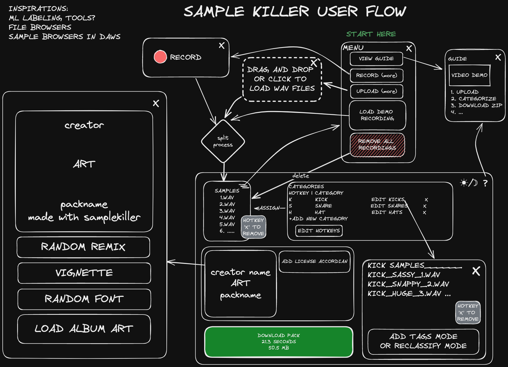

[Matrix Multiplication Visualizer](https://evanburnette.github.io/matmul_viz)

<iframe width="700" height="394" src="https://www.youtube.com/embed/hljGumIUJQ0?si=kHgHuIlfzZuklzCY" title="YouTube video player" frameborder="0" allow="accelerometer; autoplay; clipboard-write; encrypted-media; gyroscope; picture-in-picture; web-share" referrerpolicy="strict-origin-when-cross-origin" allowfullscreen></iframe>

 Build intuition for matrix multiplication with this interactive demo!
 Resize input matrices and click cells to see what's happening
 Desktop only
<iframe
  src="https://evanburnette.github.io/matmul_viz"
  title="Matrix Multiplication Visualizer"
  width="700"
  height="700"
></iframe>

[FFT window comparison](https://codepen.io/splosion/pen/XWoKdEM?editors=0011)
 Interactive sound visualization demo to teach people about windowing functions for ML audio preprocessing

  See the Pen <a href="https://codepen.io/splosion/pen/XWoKdEM">
  Tensorflow JS FFT window comparison</a> by Evan (<a href="https://codepen.io/splosion">@splosion</a>)
  on <a href="https://codepen.io">CodePen</a>.

[Svelte Drum Sequencer](https://evanburnette.github.io/svelte-drum-sequencer/)
 Interactive drum sequencer built with Svelte
 Sequence and play your own drum patterns
<iframe
  src="https://evanburnette.github.io/svelte-drum-sequencer/"
  title="Svelte Drum Sequencer"
  width="700"
  height="500"
></iframe>

[Galton Board Christmas Tree](https://editor.p5js.org/EvanBurnette/full/NuiAuynzm)
 P5.js app that uses random events to demonstrate a normal distribution 
<iframe
  src="https://editor.p5js.org/EvanBurnette/full/NuiAuynzm"
  title="Galton Board Christmas Tree"
  width="700"
  height="700"
></iframe>

[Sample Pack Creator User Flow](https://github.com/EvanBurnette/samplekiller)
 A user flow and design for a sample pack creator program

[Polyrhythm Trainer](https://evanburnette.github.io/PolyrhythmTrainer/index.html)
 Build intuition with visualization and audio playback of polyrhythms
<iframe src="https://editor.p5js.org/EvanBurnette/full/pK3MzBz2a"
    title="Polyrhythm Trainer"
    width="700"
    height="700"
></iframe>

[Electribe ER-1 Mute Calculator](https://evanburnette.github.io/ElectribeMuteCalculatorSite/index.html)
 Mute and unmute parts on the Korg ER-1 Electribe drum machine using NRPN
 Gain intuition for how this vintage drum machine transmits and stores mute states
<iframe
  src="https://evanburnette.github.io/ElectribeMuteCalculatorSite/index.html"
  title="Electribe ER-1 Mute Calculator"
  width="700"
  height="700"
></iframe>

(P5js driving sim)[https://editor.p5js.org/EvanBurnette/sketches/wQLgMLm0i]
 A work in progress trailer backup simulator to train people on how trailer physics work
 Desktop only
<iframe
src="https://editor.p5js.org/EvanBurnette/full/wQLgMLm0i"
width="700"
height="700"
></iframe>

[Pedal Board Midi Controller](https://github.com/EvanBurnette/pedalBoardMidiController)
 Code for a custom pedalboard integrated arduino based midi controller for hands free drum machine control

[Genius 2 HTML](https://github.com/EvanBurnette/genius2html)
 Scrapes Genius for all songs in an album and creates custom formatted, multi-instrument, HTML song map

<!-- [Unjumbler](https://evanburnette.github.io/unjumbler)
 Solve the popular newspaper word game Jumble™️
 Runs completely in the browser using webworkers to do the work which keeps the UI responsive to user input
 Built with Svelte, Sveltekit, Skeleton UI, Tailwind CSS, Vite, Comlink, and Typescript
<iframe
  src="https://evanburnette.github.io/unjumbler/"
  title="Unjumbler"
  width="500"
  height="500"
></iframe> -->