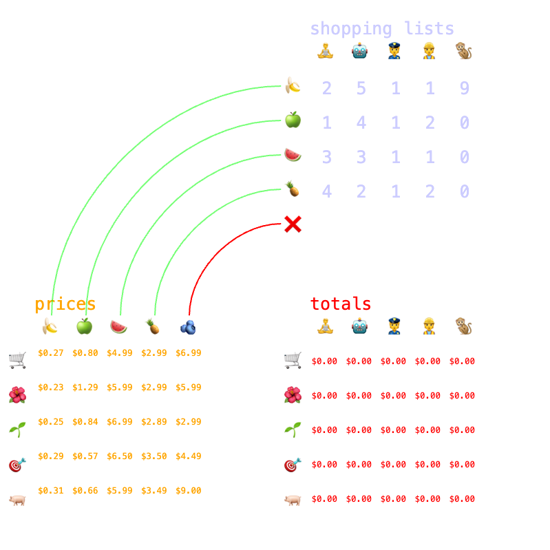

# Evan Burnette's Github Homepage

## About Me
Full stack web developer and music producer

## My Coding Projects
### Webapps

[Matrix Multiplication Visualizer](https://evanburnette.github.io/matmul_viz)
 Build intuition for matrix multiplication with this interactive demo!

[Unjumbler](https://evanburnette.github.io/unjumbler)
 Solve the popular newspaper word game Jumble™️
 Runs completely in the browser using webworkers to do the work which keeps the UI responsive to user input
 Built with Svelte, Sveltekit, Skeleton UI, Tailwind CSS, Vite, Comlink, and Typescript

[Polyrhythm Trainer](https://evanburnette.github.io/PolyrhythmTrainer/index.html)
 Build intuition with visualization and audio playback of polyrhythms

[Galton Board Christmas Tree](https://editor.p5js.org/EvanBurnette/full/NuiAuynzm)
 P5.js app that uses random events to demonstrate a normal distribution 

[Electribe ER-1 Mute Calculator](https://evanburnette.github.io/ElectribeMuteCalculatorSite/index.html)
 Mute and unmute parts on the Korg ER-1 Electribe drum machine using NRPN
 Gain intuition for how this vintage drum machine transmits and stores mute states

[Meditation App](https://evanburnette.github.io/BreathCounterMeditationApp/index.html)
 Helps you measure and count breaths and set a custom meditation session length

[Synth Playground](https://evanburnette.github.io/synthPlayground/synthPlayground.html)
 Generative music doodling with 4 instruments

[Drum Pads](https://evanburnette.github.io/DrumPads/index.html)
 MPC style drum pads you can run in Chrome browser

### Non-web coding projects
[Pedal Board Midi Controller](https://github.com/EvanBurnette/pedalBoardMidiController)
 Code for a custom pedalboard integrated arduino based midi controller for hands free drum machine control

[Genius 2 HTML](https://github.com/EvanBurnette/genius2html)
 Scrapes Genius for all songs in an album and creates custom formatted, multi-instrument, HTML song map

## Other Things Around the Web:
[My old Youtube Channel](https://www.Youtube.com/user/evanBurnettemusic2)

[My New Youtube Channel](https://www.Youtube.com/user/EvanBurnettemusic)

[Bandcamp](https://evanburnettemusic.bandcamp.com)

[Twitter](https://twitter.com/emburnette)
